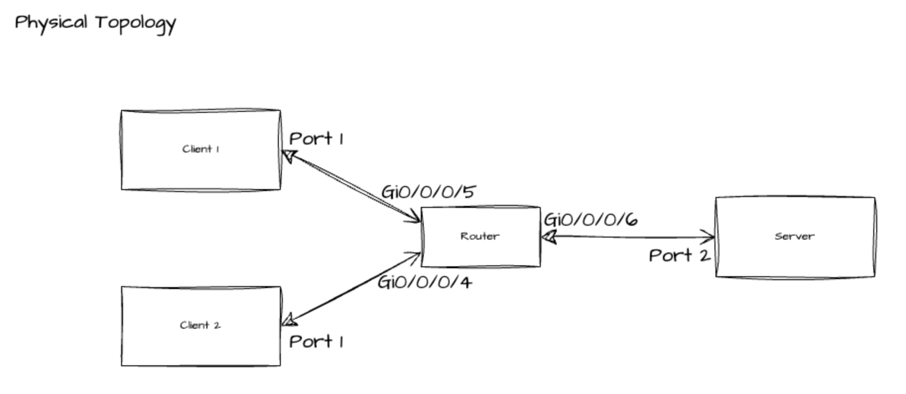
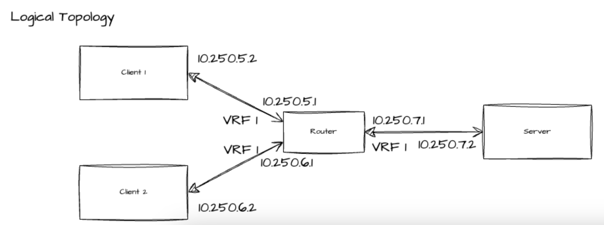
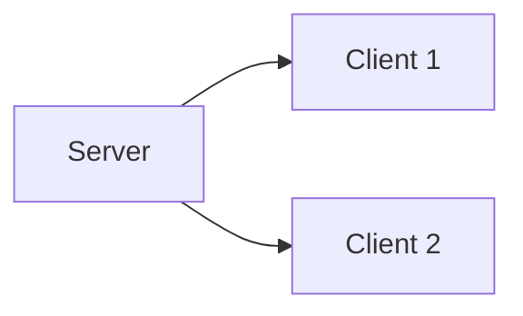

# test-integration-engineer-project

## Background

As a Test Integration Engineer at AURA, you are a key member of the test team. In your job, you will be working with subject matter experts across a variety of disciplines and backgrounds to test both hardware systems, such as routers, radios, and servers, and software systems, both vendor-purchased software and in-house developed software. You will have an opportunity to build state-of-the-art test tooling in aviation infrastructure.

Your role in our team is critical. AURA’s customers leverage our products in safety critical systems, and thus, we know that AURA must deliver products that meet a high bar of quality. You, as the lead technical engineer in test at AURA, will set this bar for quality, ensuring that the products we hand our customers are high-quality and devoid of defects.

This scenario will give both you, and us, an opportunity to learn about each other. We have developed this scenario to be **representative of the work you will be asked to do when operating in this role at AURA**. You should come to your final technical interview prepared to discuss the following scenario in detail. Additionally, you should expect to answer technical questions based on the following scenario.

## Scenario

You are developing test cases for a new network-based service. This network service enables devices running on AURA’s network to share data across a multitude of devices simultaneously using multicast network traffic. Your job in this scenario is to:

- Write interface logic to manage the services on the nodes

- Develop a custom Ansible plugin to process generated logs

- Translate a provided, free-form test case, written by a SME, into functioning code. As a part of this code, you will:

    - Setup all of the services running on the nodes

    - Copy all generated test artifacts

    - Clean up the nodes

## Physical and Logical Network Topology

The following diagram highlights the physical topology of the systems connected as a part of this test:





Each link between devices is a single physical fiber / copper cable. The network provides full IP connectivity between all devices - there are no firewalls, or other access control mechanisms blocking communication between the hosts.

## Services

The system is composed of two services:

- `foo-transmit`: A service responsible for sending data to other network devices via multicast

- `foo-receive`: A service responsible for receiving multicast data

### Data Flow

Data flows from one running instance of `foo-transmit` to one or more `foo-receive` instances:



Each packet generated by the `foo-transmit` service contains just the epoch timestamp immediately preceding packet generation. The 12-byte representation is used to include the nanos.

### `foo-transmit`

The `foo-transmit` service is responsible for transmitting packets using multicast to a specified multicast group. The underlying transport network supports PIM-SSM.

As is shown above, the `foo-transmit` service is run on the `Server`. `foo-receive` is run on `Client 1` and `Client 2`.

During each run, the `foo-transmit` service generates a `foo-transmit.log` file, containing the following information in each line:

```
epoch timestamp,number of bytes transmitted
```

A sample is shown below:

```
1672531200,12
1672531300,12
```

The `foo-transmit` service will run for 10 seconds after starting. After this time window is up,
the `foo-transmit` service exits.

### `foo-receive`

The `foo-receive` service is responsible for consuming multicast network packets on a specific multicast group. When run the service only consumes packets generated by a provided source IP address.

During each run, the `foo-receive` service generates a `foo-receive.log` file, containing the following information in each line:

```
epoch timestamp,number of bytes received
```

A sample is shown below:

```
1672531200,12
1672531300,12
```

## Technology Stack

The client devices are Raspberry Pis, running a relatively-recent version of Raspbian. The server is a 1-socket, 1U short-depth server, running a 3rd-generation Xeon Scalable processor. The server is running a container-native operating system.

The test platform is built on top of Ansible. All custom modules are written in Python, and shared functionality is located in a shared Ansible collection. Roles are available to control and manage each set of tightly-coupled functionality. A series of playbooks are used to host the individual test cases, one per playbook.

## Interview Preparation

To prepare for the technical interview, read through the attached source code. See the different open TODO statements located throughout the code. During the interview, be prepared to:

- Fill out one or multiple of the `TODO` blocks with functioning code

- Discuss the architecture of the codebase, including how the code is structured, how tests are executed, and any other details about the design of the system

As a part of the preparation, we do not expect nor ask you to write out solutions to any blocks of code.

The files which include work to be completed as a part of the technical interview are:

- `playbooks/test-case-1.yml`
- `aura/test/roles/foo_receive/stop.yml`
- `aura/test/plugins/todo.md`

## Running the code

You can run the sample playbook by running `make sample` in the root directory of this repository. If you would like to experiment and run other test cases, use the command `make <test case name>`.
